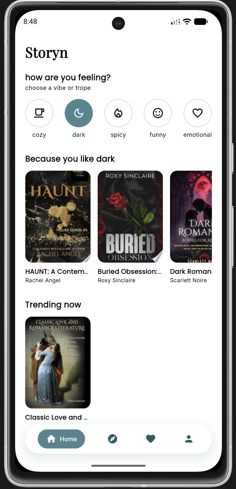
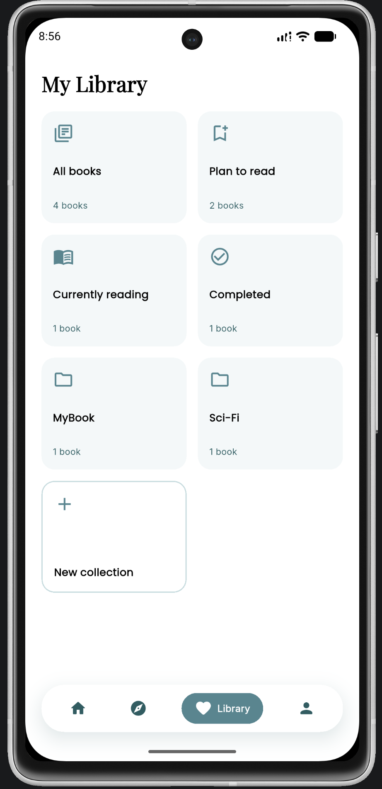
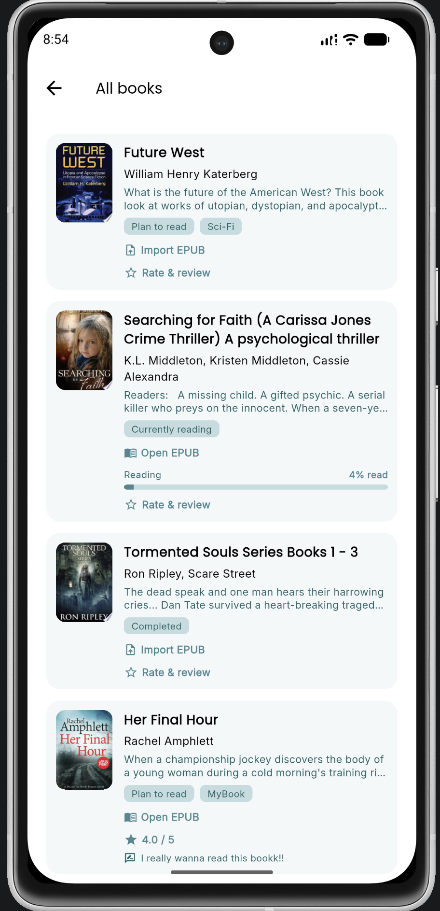
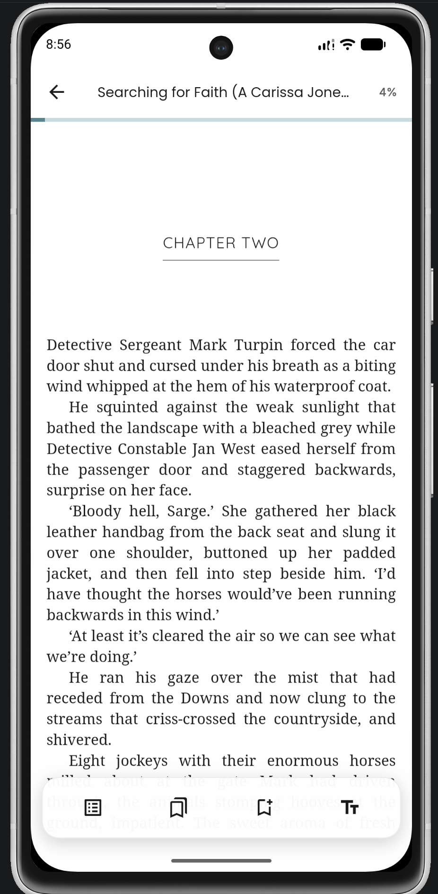
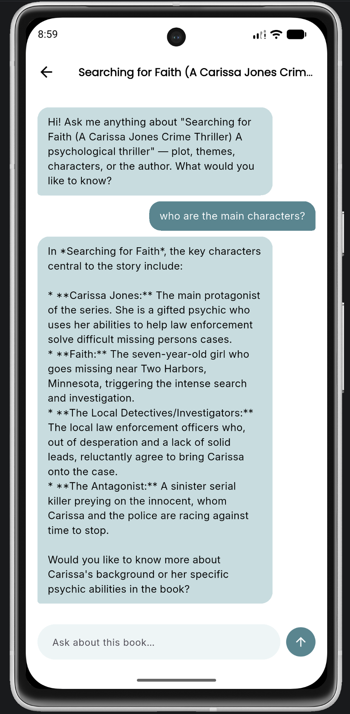

# Storyn

Storyn is a cross-platform mobile app built with Flutter that lets users search for books, save them to a personal library, read EPUB files directly in the app, and chat with an AI assistant about any book.

## Features

- **Book discovery** — search and browse books via the Google Books API
- **Personal library** — save books with reading status (Plan to Read, Currently Reading, Completed) and organize them into custom collections
- **Built-in EPUB reader** — paginated reading with adjustable font size, light/sepia/dark themes, chapter navigation, bookmarks, and automatic progress syncing
- **AI book chat** — ask an AI assistant (Google Gemini) questions about the plot, characters, themes, or author of any book, scoped to that specific title
- **User authentication & cross-device sync**
    - Sign in with **Firebase Authentication**, supporting email/password and **Google Sign-In**
    - Session handling to keep users signed in across app launches, with an 8-hour session timeout
    - Library data (saved books, collections, reading progress) is stored in **Cloud Firestore**, keyed to the user's account
    - Because of this, the same library is available on any device the user signs into
- **Profile management** — edit display name

## Screenshots

| Home                                 | Library                                    | Library Collection                              | Reader                                   | AI Chat                              |
|--------------------------------------|--------------------------------------------|--------------------------------------------------|------------------------------------------|--------------------------------------|
|  |  |  |  |  |

## Download APK

A pre-built Android APK is available for testing.

[**Download Storyn APK**](apk/storyn-release.apk)

> **Note:** This APK is provided for testing purposes. Android may display a warning when installing an APK downloaded outside the Google Play Store.


## Technologies & Tools Used

**Framework**
- [Flutter](https://flutter.dev/) — cross-platform UI toolkit
- [Dart](https://dart.dev/) — programming language

**Architecture**
- [Clean Architecture](https://blog.cleancoder.com/uncle-bob/2012/08/13/the-clean-architecture.html) (Robert C. Martin / "Uncle Bob") — domain / data / presentation layers per feature
- [Provider](https://pub.dev/packages/provider) — state management
- [GetIt](https://pub.dev/packages/get_it) — dependency injection / service locator
- [go_router](https://pub.dev/packages/go_router) — declarative routing/navigation

**Backend & Data**
- [Firebase / Cloud Firestore](https://firebase.google.com/) — cloud database for the user's library, collections, and reading progress
- [Firebase Authentication](https://firebase.google.com/docs/auth) (email/password + Google Sign-In) — user authentication
- [Google Books API](https://developers.google.com/books) — book search and metadata

**AI**
- [Google Gemini API](https://ai.google.dev/) via the `google_generative_ai` Dart package — powers the in-app AI book chat

**EPUB Rendering**
- [flutter_epub_viewer](https://pub.dev/packages/flutter_epub_viewer) — in-app EPUB rendering (built on Epub.js + flutter_inappwebview)

**Other Packages**
- `flutter_dotenv` — environment variable / API key management

## Prerequisites

Before running this project, make sure you have:

- [Flutter SDK](https://docs.flutter.dev/get-started/install) (stable channel) installed and configured
- A code editor — [Android Studio](https://developer.android.com/studio) or [VS Code](https://code.visualstudio.com/) with the Flutter extension
- An Android emulator, or physical device for testing
- A [Google Books API key](https://console.cloud.google.com/apis/library/books.googleapis.com) (for book search)
- A [Google Gemini API key](https://aistudio.google.com/apikey) (for the AI chat feature)

Verify your Flutter setup:
```bash
flutter doctor
```

## Installation & Setup

**1. Clone the repository**
```bash
git clone https://github.com/subi1313/Storyn
cd Storyn
```

**2. Install dependencies**
```bash
flutter pub get
```

**3. Configure API keys**
Create a `.env` file in the project root (can copy the api keys from the google drive file submitted):
```
GOOGLE_BOOKS_API_KEY=your_google_books_api_key_here
GEMINI_API_KEY=your_gemini_api_key_here
```

- Get a Google Books API key from the [Google Cloud Console](https://console.cloud.google.com/apis/library/books.googleapis.com) (enable the "Books API" on your project, then create an API key under Credentials).
- Get a Gemini API key from [aistudio.google.com/apikey](https://aistudio.google.com/apikey).

> ⚠️ `.env` is git-ignored and are not committed. 

**5. Run the app**
```bash
flutter run
```

## Project Structure

```
lib/
├── core/                 # Shared infrastructure (DI, routing, theming, error handling)
├── features/
│   ├── auth/             # Login/signup, session management
│   ├── books/             # Book search & discovery
│   ├── book_chat/         # AI chat about a specific book (Gemini)
│   ├── library/           # Saved books, collections, EPUB reader
│   ├── navigation/        # Bottom navigation shell
│   ├── profile/           # User profile
│   └── settings/          # App settings
└── main.dart              # App entry point, provider setup
```

## Known Limitations

- Text highlighting is not currently available in the reader.
- Push notification functionality has not yet been implemented.
- Vertical scrolling of text is not functioning properly in the reader.
---
## Author
**Supragya Singh Sipai**
